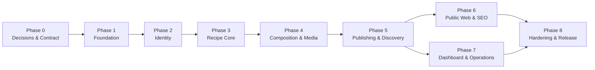

# Kế hoạch triển khai dự án Culinary Blog

> Tài liệu cơ sở: [SRS_Culinary_Blog_Analysis.md](./SRS_Culinary_Blog_Analysis.md)  
> SRS nguồn: [SRS_Culinary_Blog_v1.0.0.pdf](./SRS_Culinary_Blog_v1.0.0.pdf)  
> Ngày lập kế hoạch: 09/09/2026  
> Baseline giải mâu thuẫn: Accepted — 11/09/2026 — [SRS Conformance and Conflict Resolution](./phase-0/00_SRS_Conformance_and_Resolution.md)  
> Mục tiêu: tổ chức quá trình xây dựng Culinary Blog thành các phase có đầu vào, công việc, đầu ra và tiêu chí nghiệm thu rõ ràng.

## 1. Mục tiêu và nguyên tắc của kế hoạch

Kế hoạch này hướng đến một phiên bản Culinary Blog v1.0 có thể vận hành hoàn chỉnh, không chỉ là bản demo giao diện. Sản phẩm cuối phải có backend, frontend, cơ sở dữ liệu, object storage, cache, background jobs, bảo mật, quan sát hệ thống, kiểm thử và tài liệu triển khai.

Các nguyên tắc điều hành:

- Không bắt đầu migration/API chính thức trước khi khóa các mâu thuẫn blocking trong Phase 0.
- OpenAPI và business rule là contract chung giữa backend, frontend và QA.
- Xây theo lát cắt dọc: mỗi phase tạo ra một năng lực có thể chạy và kiểm thử được.
- Mỗi chức năng phải xử lý đầy đủ happy path, validation, authorization, failure path và observability.
- Public data và private data được tách ngay từ thiết kế để tránh rò Draft/Archived qua cache hoặc ISR.
- Bảo mật, test và vận hành được thực hiện trong từng phase, không dồn toàn bộ về cuối.
- Phase chỉ được đóng khi đạt exit gate; công việc chưa đạt không được xem là hoàn thành chỉ vì code đã merge.

## 2. Giả định lập kế hoạch

### 2.1. Cấu hình nhóm tham chiếu

Ước lượng trong tài liệu phù hợp với nhóm nhỏ:

- 01 Product Owner/Business Analyst bán thời gian.
- 01 Technical Lead/Backend Developer.
- 01 Backend Developer.
- 01 Frontend Developer.
- 01 QA Engineer; DevOps có thể do Technical Lead phụ trách.

Nhóm làm theo sprint 2 tuần. Với nhóm trên, kế hoạch dự kiến khoảng **14–17 tuần**, tùy phạm vi các GAP được đưa vào v1. Nếu một người thực hiện toàn bộ dự án, nên giữ nguyên thứ tự phase nhưng dự kiến khoảng **24–32 tuần**.

Ước lượng là mốc quản lý, không phải cam kết cố định. Sau Phase 0 phải estimate lại dựa trên OpenAPI, wireframe và quyết định phạm vi đã duyệt.

### 2.2. Baseline kỹ thuật

- Backend: .NET 10 Minimal APIs, Clean Architecture, CQRS/MediatR.
- Frontend: Next.js 15 App Router, Node.js 20 LTS, TypeScript, Tailwind CSS, Auth.js v5, TanStack Query, React Hook Form, Zod.
- Data: PostgreSQL 16 và EF Core Code First.
- Cache: Redis 7 hoặc .NET Output Cache dùng Redis-backed store.
- Storage: MinIO/S3 với bucket private; Published media qua public proxy/CDN, Draft/Archived qua authorized short-lived URL.
- Jobs: Hangfire với PostgreSQL storage, idempotency và Transactional Outbox.
- Auth: ASP.NET Core Identity, PBKDF2-HMACSHA512 (ít nhất 100.000 iterations), JWT HS256, refresh token 512-bit trong request body và rotation/reuse detection.
- Runtime: Docker Compose và Nginx.
- Observability: Serilog, OpenTelemetry, health checks.

Nếu Phase 0 thay đổi baseline, ADR và kế hoạch phải được cập nhật trước khi triển khai.

## 3. Tổng quan các phase

| Phase | Tên | Thời lượng tham chiếu | Kết quả chính |
|---|---|---:|---|
| 0 | Khóa đặc tả và kiến trúc | 1 tuần | Decision log, ADR, OpenAPI skeleton, backlog và acceptance criteria được duyệt |
| 1 | Khởi tạo nền tảng và môi trường | 1–2 tuần | Solution/app chạy qua Docker, CI và các cross-cutting concern cơ bản |
| 2 | Identity và quản lý phiên | 2 tuần | Register/login/refresh/logout/profile hoạt động an toàn |
| 3 | Category và Recipe Core | 2–3 tuần | Author tạo/quản lý Draft; Admin quản lý category; ownership và concurrency hoạt động |
| 4 | Thành phần công thức, media và jobs | 2 tuần | Ingredient, step, nutrition, image và background processing hoàn chỉnh |
| 5 | Publishing, discovery và cache | 2 tuần | Publish lifecycle, public listing, search/filter/sort và Redis cache |
| 6 | Public Web, SEO và accessibility | 2 tuần | Trải nghiệm đọc/tìm công thức responsive, SEO-ready và accessible |
| 7 | Dashboard Author/Admin và vận hành | 1–2 tuần | Authoring UX hoàn chỉnh, Admin UI và operational controls |
| 8 | Hardening, UAT và phát hành | 1–2 tuần | Kiểm thử phi chức năng, staging sign-off và production release |

Các phase có thể gối đầu sau khi contract ổn định. Frontend có thể dùng mock server từ OpenAPI; QA có thể viết test case song song với development.

## 4. Phase 0 — Khóa đặc tả và kiến trúc

### 4.1. Mục tiêu

Loại bỏ các quyết định mơ hồ có thể làm thay đổi schema, API, bảo mật hoặc chiến lược cache. Các quyết định đã được chốt ngày 11/09/2026 và được thể hiện trong Conformance Baseline, OpenAPI, Data Dictionary, Error Catalog cùng các ADR.

### 4.2. Đầu vào

- SRS v1.0.0.
- Tài liệu phân tích SRS.
- Phạm vi v1 do Product Owner phê duyệt.

### 4.3. Công việc chi tiết

#### Product/Business

- P0-01: Xác nhận 34 FR; số 27 trong phần mô tả là lỗi đếm.
- P0-02: Giữ MoSCoW của PDF; chức năng không có FR đầy đủ chuyển Post-v1/Change Request.
- P0-03: Publish invariant là category hợp lệ, ít nhất 1 ingredient và 1 step; ảnh không bắt buộc.
- P0-04: Recipe/Category soft delete; không hard purge hoặc restore trong v1.
- P0-05: Author tự publish recipe của mình; moderation nằm ngoài v1.

#### Architecture/Backend

- P0-06: ADR-001 — soft delete Recipe và Category; không purge trong v1.
- P0-07: ADR-002 — validation dùng `400`; concurrency conflict dùng `409`.
- P0-08: ADR-003 — PostgreSQL concurrency dùng `Version bigint` và ETag/If-Match.
- P0-09: ADR-004 — refresh token storage, rotation, family ID và client storage.
- P0-10: ADR-005 — Auth.js sở hữu OAuth callback; backend verify Google ID token.
- P0-11: ADR-006 — public/private MinIO delivery.
- P0-12: ADR-007 — Redis-backed cache, key namespace, TTL và invalidation.
- P0-13: ADR-008 — FTS tiếng Việt dùng `simple + unaccent`, GIN và `pg_trgm` fallback.
- P0-14: ADR-009 — Transactional Outbox và compensation cho DB/MinIO/Hangfire dual-write.
- P0-15: Chuẩn hóa data dictionary:
  - `displayName` thay cho `fullName`;
  - `orderIndex` thay cho `sortOrder`;
  - `timerMinutes` thay cho `durationMinutes`;
  - profile gồm `displayName`, `avatarUrl`, `bio`;
  - `cookTime >= 0` và category name tối đa 100 ký tự.

#### API/Frontend/QA

- P0-16: Viết OpenAPI skeleton cho toàn bộ endpoint v1.
- P0-17: Chốt response envelope `data/meta` và RFC 7807 error schema.
- P0-18: Chốt application error code catalog.
- P0-19: Tách endpoint public Published khỏi private dashboard, tối thiểu có `GET /me/recipes`.
- P0-20: Lập sitemap route và wireframe mức luồng cho public web, auth, author dashboard và Admin category.
- P0-21: Lập traceability matrix `FR → business rule → endpoint → screen → test`.
- P0-22: Viết acceptance criteria cho năm critical journeys.
- P0-23: Threat modeling cho authentication, upload, object visibility, cache và authorization.

### 4.4. Đầu ra bàn giao

- Decision log đã duyệt cho GAP-001 đến GAP-033.
- Tối thiểu 9 ADR nêu trên.
- OpenAPI skeleton và error-code catalog.
- Data dictionary thống nhất.
- Route map/wireframe luồng chính.
- Product backlog đã ưu tiên và traceability matrix.
- Test strategy và threat model bản đầu.

### 4.5. Exit gate

- Không còn GAP mức blocking chưa có quyết định.
- Request/response/error contract khớp OpenAPI, Error Catalog và Conformance Baseline.
- Soft-delete, concurrency, token storage, Google flow, FTS và image visibility đã có ADR.
- Must-have backlog có acceptance criteria có thể kiểm thử.
- Baseline v1 ở trạng thái Accepted; thay đổi mới phải qua Change Request.

## 5. Phase 1 — Khởi tạo nền tảng và môi trường

> Trạng thái 12/09/2026: **Implementation Complete / Local Accepted**. Bằng chứng tại [Phase 1 verification](./phase-1/README.md); còn chờ chạy workflow trên clean CI runner và kiểm tra onboarding độc lập trước khi `Accepted / Closed`.

### 5.1. Mục tiêu

Tạo nền tảng có thể build, chạy, kiểm thử và quan sát được. Kết thúc phase, developer mới phải setup local stack trong dưới 5 phút sau khi đã có SDK/Docker.

### 5.2. Phụ thuộc

- Phase 0 đã chốt baseline công nghệ, version và conventions.
- Có quyền truy cập source control và CI runner.

### 5.3. Công việc chi tiết

#### Repository và backend

- P1-01: Tạo solution/project:
  - `CulinaryBlog.Domain`;
  - `CulinaryBlog.Application`;
  - `CulinaryBlog.Infrastructure`;
  - `CulinaryBlog.Api`;
  - unit, integration và architecture test projects.
- P1-02: Thiết lập dependency direction và architecture tests.
- P1-03: Thiết lập central package management, nullable, analyzers, warnings-as-errors và `.editorconfig`.
- P1-04: Tạo composition root và extension methods `AddApplication`, `AddInfrastructure`, `AddPresentation`.
- P1-05: Tạo CQRS/MediatR pipeline: logging, Application-layer FluentValidation, cache và performance warning khi request/handler vượt 500ms.
- P1-06: Tạo Problem Details/global exception handling và mapping error code.
- P1-07: Tạo Correlation ID middleware; propagate qua response/log/trace.
- P1-08: Cấu hình Serilog structured JSON với CorrelationId, RequestPath, method/status/elapsed và UserId; rolling file theo ngày, Seq development và lọc dữ liệu nhạy cảm.
- P1-09: Cấu hình OpenTelemetry cho ASP.NET Core, HttpClient và EF Core.
- P1-10: Tạo `/health/live` cho process, `/health/ready` cho PostgreSQL+Redis và `/health` cho PostgreSQL+Redis+MinIO; public chỉ trả aggregate status, detail chỉ mở internal/ops.
- P1-10a: Cấu hình rate limit API chung 100 request/phút/IP; auth và upload được override ở phase tương ứng.

#### Frontend

- P1-11: Tạo Next.js App Router app với TypeScript strict mode.
- P1-12: Cấu hình Tailwind, ESLint, Prettier, import alias và environment schema validation.
- P1-13: Tạo route groups cho public, auth và dashboard.
- P1-14: Tạo layout, theme tokens, typography, base form/button/modal/toast/skeleton components.
- P1-15: Tạo API client typed từ OpenAPI hoặc shared generated types.
- P1-16: Cấu hình TanStack Query provider, global error boundary và Problem Details parser.

#### Data/Infrastructure

- P1-17: Docker Compose development gồm PostgreSQL, Redis, MinIO, MailHog và Seq.
- P1-18: Thêm named volumes, healthcheck và dependency readiness; không lưu secret thật trong compose.
- P1-19: Tạo `.env.example`/configuration documentation, user-secrets instructions và fail-fast config validation.
- P1-20: Dockerfile multi-stage cho API và frontend; pin base image version.
- P1-21: Cấu hình Nginx local/staging cơ bản và route `/api`, frontend, health.
- P1-22: Chuẩn bị MinIO bootstrap để tạo bucket/policy idempotent.

#### CI/QA

- P1-23: Pipeline restore/build/lint/unit test/architecture test.
- P1-24: Thêm dependency, container và secret scan.
- P1-25: Tạo test fixtures/Testcontainers foundation cho PostgreSQL, Redis và MinIO.
- P1-26: Tạo smoke test khởi động stack và gọi health endpoints.
- P1-27: Viết README setup, run, test, migration và troubleshooting.

### 5.4. Đầu ra bàn giao

- Repository/solution/app skeleton build sạch.
- Local stack chạy bằng một quy trình chuẩn.
- CI có quality gates cơ bản.
- API có Problem Details, correlation, logging, tracing và health checks.
- Frontend có design foundation, typed API client và error handling cơ bản.

### 5.5. Exit gate

- Build backend/frontend không có warning bị cấm.
- Architecture tests ngăn dependency sai.
- `docker compose up` đưa toàn bộ dependency đến trạng thái healthy.
- CI chạy lại được trên clean runner.
- Correlation ID xuất hiện trong response, logs và trace.
- Developer khác làm theo README và chạy project thành công trong dưới 5 phút, không tính thời gian tải image/package lần đầu.

## 6. Phase 2 — Identity và quản lý phiên

### 6.1. Mục tiêu

Hoàn thành luồng tài khoản và phiên an toàn để các phase nghiệp vụ dùng chung authentication/authorization ổn định.

### 6.2. Phụ thuộc

- Phase 1 hoàn thành.
- ADR token storage và Google flow đã duyệt.
- SMTP/MailHog và OAuth credentials cho từng môi trường đã được xác định.

### 6.3. Công việc chi tiết

#### Data và backend

- P2-01: Cấu hình ASP.NET Core Identity và `ApplicationUser`.
- P2-01a: Cấu hình password hashing PBKDF2-HMACSHA512 với iteration count ít nhất 100.000 và kiểm thử không lưu plaintext.
- P2-02: Tạo Role `Author`, `Admin`; seed Admin bằng secret/config an toàn, idempotent.
- P2-03: Tạo `RefreshToken` với `TokenHash`, `FamilyId`, expiry, revoke metadata và indexes.
- P2-04: Migration Identity/RefreshToken đầu tiên và integration test migration.
- P2-05: `POST /auth/register`:
  - normalize/unique email;
  - password policy;
  - role Author;
  - auto-login;
  - enqueue welcome email sau commit.
- P2-06: `POST /auth/login` với lỗi generic, access-failed count, 5 lần sai và lockout 15 phút.
- P2-07: JWT access token 15 phút có `sub`, email, roles, `jti`, issuer/audience.
- P2-08: Refresh token ngẫu nhiên 512-bit, TTL 7 ngày, SHA-256 DB hash, body transport, rotation atomic và family reuse detection.
- P2-09: `POST /auth/refresh` và concurrent refresh protection ở database.
- P2-10: `POST /auth/logout` nhận refresh token trong body, idempotent, hoạt động khi access token hết hạn; không log token.
- P2-11: `GET/PATCH /auth/me` cho `displayName`, `avatarUrl`, `bio`.
- P2-12: Policies `AuthorPolicy`, `AdminPolicy`; kiểm tra `IsActive` trên phiên hiện tại.
- P2-13: Rate limit auth 10 request/phút/IP và header `Retry-After`.
- P2-14: Google sign-in theo ADR; xác minh issuer, audience, expiry, nonce/state và verified email.
- P2-15: Welcome-email job retry tại 1, 5 và 30 phút; lỗi email không rollback user.

#### Frontend

- P2-16: Trang register với client validation khớp server.
- P2-17: Trang login, Google button và error state không lộ account enumeration.
- P2-18: Auth state/provider, protected route UX và redirect sau login.
- P2-19: Single-flight refresh: chỉ một refresh request chạy khi nhiều API request cùng nhận 401.
- P2-20: Logout, clear client state và invalidate private query cache.
- P2-21: Trang profile xem/sửa thông tin.
- P2-22: Loading, inline errors, toast và keyboard navigation.

#### QA/Security

- P2-23: Unit test token service, validators và authorization policies.
- P2-24: Integration test register/login/profile/logout.
- P2-25: Test rotation, replay token cũ, concurrent refresh và revoke family.
- P2-26: Test inactive user, lockout, rate limit, expired/tampered token và authorization matrix.
- P2-27: Test Google happy/error/link-existing-account nếu Google thuộc v1.
- P2-28: Kiểm tra logs/Problem Details không chứa password, raw JWT hoặc refresh token.

### 6.4. Đầu ra bàn giao

- Identity schema và migration ổn định.
- Toàn bộ local authentication lifecycle hoạt động.
- Google login nếu được xác nhận thuộc phase/v1.
- Auth UI và profile UI.
- Welcome email chạy qua Hangfire/MailHog.
- Bộ test bảo mật cho token, lockout và rate limiting.

### 6.5. Exit gate

- Critical journey `register → auto-login → profile` pass E2E.
- Critical journey `login → refresh → logout → refresh cũ bị từ chối` pass E2E.
- Hai refresh đồng thời không tạo hai token hợp lệ ngoài policy.
- Author/Admin policies có integration tests.
- Không lưu plaintext password/raw refresh token ở DB hoặc logs.
- Phase security review không còn issue Critical/High chưa có biện pháp chấp nhận.

## 7. Phase 3 — Category và Recipe Core

### 7.1. Mục tiêu

Xây dựng aggregate Recipe, Category và khả năng lưu nháp có ownership/concurrency đúng. Đây là nền tảng cho media, publishing và discovery.

### 7.2. Phụ thuộc

- Phase 2 hoàn thành policies và current-user abstraction.
- Data dictionary, soft-delete và concurrency ADR đã khóa.

### 7.3. Công việc chi tiết

#### Domain và data

- P3-01: Tạo `BaseEntity`, audit fields, soft-delete rule và `Version bigint`.
- P3-02: Tạo `Category`, `Recipe`, `RecipeNutrition`, enums `RecipeStatus`, `RecipeDifficulty`.
- P3-03: Domain methods tạo/cập nhật/archive/unarchive/soft-delete; chưa mở publish khi composition chưa hoàn thành.
- P3-04: EF configurations, check constraints và indexes cho slug, status, category, author, published time.
- P3-05: Unique slug/name toàn bảng, kể cả record soft-deleted, để không tái sử dụng URL cũ.
- P3-06: Audit interceptor; global query filters; explicit query API cho Admin/restore.
- P3-07: Migration và seed category/test users/test recipe có tính tái lập.

#### Category backend

- P3-08: Public `GET /categories` và `GET /categories/{slug}` chỉ trả Published recipe.
- P3-09: Admin `POST/PUT /categories`; `DELETE` được triển khai nếu FR-CAT-005 Should nằm trong release.
- P3-10: Chặn xóa category còn recipe theo retention rule.
- P3-11: Slug unique/ổn định và xử lý race bằng DB constraint.

#### Recipe backend

- P3-12: `POST /recipes` tạo Draft thuộc current user.
- P3-13: `PUT /recipes/{id}` với resource authorization và `If-Match`.
- P3-14: `GET /recipes/{slug}` public chỉ cho Published; owner/Admin có private query riêng hoặc preview rõ ràng.
- P3-15: `GET /me/recipes` cho Draft/Published/Archived của current user.
- P3-16: `DELETE /recipes/{id}` theo soft-delete ADR.
- P3-17: `GET /admin/recipes` và `GET /admin/recipes/{id}` để Admin xem mọi trạng thái và mọi owner.
- P3-18: Slug sinh từ title, collision thêm suffix `-2/-3`; bất biến sau publish đầu tiên; 409 chỉ khi race chưa resolve.
- P3-19: Cache interface chưa cần tối ưu nhưng handler phải thiết kế để Phase 5 thêm caching không đổi contract.

#### Frontend

- P3-20: Dashboard recipe listing theo status và empty/loading/error state.
- P3-21: Form tạo/sửa thông tin cơ bản và nutrition.
- P3-22: Draft autosave hoặc explicit save theo UX đã duyệt.
- P3-23: Hiển thị concurrency conflict với hành động reload; không overwrite âm thầm.
- P3-24: Admin category list/create/edit/delete UI.
- P3-25: Ẩn/disable action theo role để cải thiện UX, không thay thế backend authorization.

#### QA

- P3-26: Domain tests state, slug, soft-delete và category constraints.
- P3-27: Authorization matrix Guest/owner/other Author/Admin.
- P3-28: Concurrent update test với stale ETag.
- P3-29: Test global filters và đảm bảo public endpoint không trả Draft/Archived/deleted.
- P3-30: Test category delete conflict và unique races.

### 7.4. Đầu ra bàn giao

- Category read/create/update có phân quyền; delete chỉ khi FR-CAT-005 Should được đưa vào release.
- Recipe Draft CRUD, profile ownership và concurrency.
- Dashboard tối thiểu cho recipe/category.
- Schema/migration cho core entities.

### 7.5. Exit gate

- Author tạo, xem, sửa và soft-delete Draft của mình.
- Author khác nhận 403 và không thể suy đoán dữ liệu private qua response/cache.
- Admin thao tác được trên mọi recipe/category đúng policy.
- Stale update trả 409 với application error code thống nhất.
- Nếu FR-CAT-005 được triển khai, Category có Recipe không thể bị xóa.
- Migration apply trên database sạch và upgrade từ migration trước đều pass.

## 8. Phase 4 — Thành phần công thức, media và background jobs

### 8.1. Mục tiêu

Cho phép Author hoàn thiện toàn bộ nội dung một công thức: nguyên liệu, các bước, dinh dưỡng và ảnh; các tác vụ chậm chạy an toàn ngoài HTTP request.

### 8.2. Phụ thuộc

- Recipe aggregate và ownership Phase 3 ổn định.
- MinIO visibility và Outbox/compensation ADR đã duyệt.

### 8.3. Công việc chi tiết

#### Ingredient, step và nutrition

- P4-01: Entity/configuration `RecipeIngredient`, `RecipeStep`, indexes và cascade/soft-delete semantics.
- P4-02: CRUD ingredient với `orderIndex`; hỗ trợ quantity/unit nullable cho “vừa đủ” theo baseline.
- P4-03: CRUD step với title, description, timerMinutes, imageUrl.
- P4-04: StepNumber liên tục; thêm cuối; xóa/reorder trong transaction không vi phạm unique constraint.
- P4-05: Update RecipeNutrition trong aggregate.
- P4-06: Chặn mutation làm Published recipe thiếu ingredient/step; trả `409 RECIPE_STATE_CONFLICT` và yêu cầu unpublish trước.
- P4-07: Cân nhắc bulk reorder endpoints để tránh nhiều request/conflict.

#### File storage và image

- P4-08: `IFileStorageService` và MinIO/S3 implementation.
- P4-09: Upload streaming, giới hạn 5 MB trước khi buffer toàn bộ.
- P4-10: MIME allowlist, magic-byte/decode validation và GUID object key.
- P4-10a: Cấu hình rate limit upload 5 request/phút/IP và trả 429 kèm `Retry-After`.
- P4-11: `POST /recipes/{id}/images` sau ownership check.
- P4-12: PATCH image metadata: `altText`, `isPrimary`, `orderIndex`; primary switch atomic.
- P4-13: DELETE image idempotent; tự chọn primary mới nếu cần.
- P4-14: Bucket private; private object access và Published delivery theo ADR-006.
- P4-15: Cleanup object mồ côi khi upload thành công nhưng DB commit thất bại.

#### Background jobs

- P4-16: Hangfire PostgreSQL storage, worker configuration và Admin-only dashboard.
- P4-17: Image resize job tạo medium 800×600 và thumbnail 300×300.
- P4-18: Object deletion job idempotent, retry 3 lần.
- P4-19: Outbox dispatcher hoặc compensation mechanism đã chọn.
- P4-20: Job correlation, structured logs, retry/dead-letter visibility và metrics.
- P4-21: Reconciliation job tối thiểu tìm object/record mồ côi và emit metric/log; dashboard replay nâng cao để Post-v1.

#### Frontend

- P4-22: Wizard các bước: basic/nutrition → ingredients → steps → images → preview.
- P4-23: Add/edit/delete/reorder ingredient và step.
- P4-24: Upload progress, format/size validation phía client và server error mapping.
- P4-25: Gallery, primary image, alt text và retry upload.
- P4-26: Giữ Draft đã save khi một bước wizard lỗi hoặc reload trang.

#### QA/Security

- P4-27: Test spoofed MIME, bad magic bytes, oversized/chunked upload và path traversal filename.
- P4-28: Test owner/other Author/Admin trên mọi child endpoint.
- P4-29: Test unique primary image và concurrent primary switch.
- P4-30: Test step renumber/reorder và transaction rollback.
- P4-31: Test job retry, idempotency, worker restart, MinIO unavailable và orphan cleanup.

### 8.4. Đầu ra bàn giao

- Recipe composition API/UI hoàn chỉnh.
- Secure image pipeline với original/medium/thumbnail.
- Hangfire jobs có retry và quan sát được.
- Authoring wizard có khả năng khôi phục Draft.

### 8.5. Exit gate

- Author hoàn thiện một Draft có ingredient và step; nutrition/ảnh được quản lý đúng khi có nhưng ảnh không phải điều kiện publish.
- File giả mạo/oversize bị từ chối mà không tạo object/DB record mồ côi.
- Chỉ owner/Admin quản lý được child resources.
- Worker restart không làm mất queued job đã persist.
- Job chạy lặp không tạo duplicate hoặc lỗi dữ liệu.
- Draft/Archived image không truy cập công khai trái policy.

## 9. Phase 5 — Publishing, discovery và cache

### 9.1. Mục tiêu

Hoàn thiện vòng đời nội dung và khả năng khám phá công thức công khai với search/filter/sort/pagination có hiệu năng và cache an toàn.

### 9.2. Phụ thuộc

- Phase 4 cung cấp Recipe aggregate đầy đủ.
- Publish invariant, FTS và cache ADR đã duyệt.

### 9.3. Công việc chi tiết

#### Publishing lifecycle

- P5-01: `PATCH /recipes/{id}/publish` và validate toàn aggregate.
- P5-02: Ghi `PublishedAt` lần đầu; không thay đổi slug sau lần publish đầu.
- P5-03: `PATCH /recipes/{id}/unpublish` về Draft.
- P5-04: `PATCH /recipes/{id}/archive` và `/unarchive` nếu thuộc v1.
- P5-05: Bảo đảm Published-only trong public listing/search/category/sitemap.
- P5-06: Audit events/metrics `recipe.created`, `recipe.published`, `recipe.unpublished`.

#### Discovery backend

- P5-07: Migration bật `unaccent`, `pg_trgm` và search vector/trigger theo ADR.
- P5-08: Technical verification bằng dữ liệu có dấu/không dấu trước khi hoàn thiện query.
- P5-09: `GET /recipes` public Published-only.
- P5-10: `GET /recipes/search?q=...` với normalization, prefix matching/ranking.
- P5-11: Filter category, difficulty, maxCookTime, minServings, minPrepTime và maxPrepTime theo AND.
- P5-12: Sort allowlist; mặc định newest; chống injection qua field sort.
- P5-13: Offset pagination page ≥1, default size 12, max 50, `data/meta` thống nhất.
- P5-14: Query projection và indexes; không N+1; cảnh báo query trên 100ms; review EXPLAIN ANALYZE cho query chính trước merge.

#### Redis/cache/consistency

- P5-15: Redis-backed cache cho public data:
  - category list 30 phút;
  - recipe detail 5 phút;
  - recipe list 15 phút;
  - search 1 phút hoặc không cache truy vấn ít lặp.
- P5-16: Cache key chứa version, locale nếu có và toàn bộ query parameters đã normalize.
- P5-17: Tuyệt đối không dùng shared public key cho private data.
- P5-18: Tag/key invalidation sau create/update/delete/publish/unpublish/archive/image/step/ingredient.
- P5-19: Graceful degradation về DB khi Redis unavailable.
- P5-20: Metrics hit/miss/latency/invalidation failure.

#### Sitemap/revalidation

- P5-21: Recurring sitemap job 02:00 UTC, chỉ gồm Published recipe/category/static pages.
- P5-22: Giữ sitemap gần nhất khi job thất bại; retry 2 lần.
- P5-23: Thiết kế trigger/debounce revalidation frontend sau publish/update/unpublish.
- P5-24: Xác minh cơ chế thông báo search engine còn được hỗ trợ trước khi tích hợp; không hardcode endpoint chưa được kiểm chứng.

#### QA/Performance

- P5-25: Search tests tiếng Việt có dấu/không dấu, ký tự đặc biệt, empty result.
- P5-26: Filter/sort/pagination contract tests.
- P5-27: Cache isolation tests với Guest/Author/Admin.
- P5-28: Cache hit/miss/invalidation và Redis outage tests.
- P5-29: Benchmark query/index trên seed dataset và báo cáo execution plan.

### 9.4. Đầu ra bàn giao

- Recipe lifecycle hoàn chỉnh.
- Public API listing/detail/category/search ổn định.
- Redis cache và invalidation an toàn.
- Sitemap và revalidation flow.

### 9.5. Exit gate

- Publish thiếu ingredient/step trả `400 RECIPE_PUBLISH_INCOMPLETE`; publish hợp lệ xuất hiện ở public discovery.
- Unpublish/archive biến mất khỏi public API/cache/search mà không lộ dữ liệu cũ quá policy.
- Search “pho” tìm được dữ liệu “phở” theo acceptance đã chốt.
- Không có cache test nào trả private content cho Guest/user khác.
- Redis down không làm core read API crash.
- Query chính không có N+1 và đạt baseline latency trên môi trường test chuẩn.

## 10. Phase 6 — Public Web, SEO và accessibility

### 10.1. Mục tiêu

Tạo trải nghiệm công khai hoàn chỉnh cho Guest, tối ưu rendering, SEO, responsive và accessibility mà không trộn nội dung private vào ISR/public cache.

### 10.2. Phụ thuộc

- Public API và publishing semantics Phase 5 ổn định.
- Design tokens/wireframe đã có từ Phase 0–1.

### 10.3. Công việc chi tiết

#### Public pages

- P6-01: Trang chủ `/` với featured recipes và categories.
- P6-02: `/recipes` với filter, sort, pagination và URL state.
- P6-03: `/recipes/[slug]` với image gallery, author, nutrition, ingredient và ordered steps.
- P6-04: `/categories` và `/categories/[slug]`.
- P6-05: `/search` với debounced input phù hợp, loading/empty/error và query trong URL.
- P6-06: 404/not-found, error boundary và offline/network error UX.

#### Rendering và cache frontend

- P6-07: ISR cho homepage/category/Published detail theo TTL đã chốt.
- P6-08: SSR cho dynamic listing/search khi cần query state.
- P6-09: Draft/Archived preview qua private dynamic route; không dùng Published ISR key.
- P6-10: Revalidate path/tag sau content mutation.
- P6-11: `next/image`, responsive sizes, blur/placeholder phù hợp và tránh layout shift.

#### SEO

- P6-12: Dynamic title/description/canonical/Open Graph/Twitter card.
- P6-13: JSON-LD Schema.org Recipe với ingredient, instruction, author, time, yield, nutrition.
- P6-14: Published dùng `index,follow`; private Draft/Archived dùng `noindex` và không xuất hiện sitemap.
- P6-15: `robots.txt`, sitemap URL và metadata tests.
- P6-16: Kiểm tra rich result bằng công cụ/validator phù hợp trước release.

#### Responsive và accessibility

- P6-17: Mobile 320–767, tablet 768–1199, desktop ≥1200.
- P6-18: Semantic HTML, heading order, landmarks và accessible names.
- P6-19: Keyboard navigation, visible focus, Escape behavior và focus trap cho modal.
- P6-20: Contrast AA, alt text strategy và screen-reader announcements cho async state.
- P6-21: Axe automated tests và manual NVDA/VoiceOver smoke test.

#### Performance/QA

- P6-22: Lighthouse CI budget: LCP ≤2.5 s, CLS ≤0.1, INP ≤200 ms, first-load JS gzip ≤200 KB.
- P6-23: Bundle analysis và code splitting.
- P6-24: Visual/responsive regression cho route chính.
- P6-25: SEO metadata/JSON-LD snapshot hoặc schema tests.

### 10.4. Đầu ra bàn giao

- Toàn bộ public routes và discovery UX.
- Rendering/caching strategy đúng theo public/private boundary.
- SEO metadata, JSON-LD, sitemap và robots.
- Responsive/a11y test report.

### 10.5. Exit gate

- Guest hoàn thành flow `home → filter/search → recipe detail` trên mobile và desktop.
- Lighthouse CI đạt budget trên môi trường/cấu hình đã ghi nhận.
- Không có axe violation mức Critical/Serious chưa xử lý.
- Published recipe pass structured-data validation.
- Draft/Archived không nằm trong HTML public cache, sitemap hoặc search index.

## 11. Phase 7 — Dashboard Author/Admin và vận hành

### 11.1. Mục tiêu

Hoàn thiện trải nghiệm quản trị nội dung và các công cụ vận hành cần thiết trước khi bước vào release hardening.

### 11.2. Phụ thuộc

- Các API authoring/publishing đã ổn định.
- Role/ownership và Admin policies đã được kiểm thử.

### 11.3. Công việc chi tiết

#### Author dashboard

- P7-01: Dashboard summary: số Draft/Published/Archived và recent recipes.
- P7-02: Recipe table/card với filter status, pagination và actions hợp lệ.
- P7-03: Hoàn thiện create/edit wizard, preview, save state và navigation guard khi có thay đổi chưa lưu.
- P7-04: Publish/unpublish/soft-delete confirmation UX; archive/unarchive khi FR-RCP-006 Should được đưa vào release.
- P7-05: Hiển thị validation tổng hợp và deep link đến wizard step bị lỗi.
- P7-06: Conflict UX cho stale version: reload, xem thay đổi mới hoặc hủy local edits.

#### Admin

- P7-07: Category CRUD hoàn chỉnh, order, delete conflict và confirm dialog.
- P7-08: Admin recipe listing/action dùng `/admin/recipes`; mọi mutation vẫn qua resource policy và audit.
- P7-10: Hangfire dashboard bảo vệ bằng Admin policy và network restriction phù hợp.
- P7-11: Admin có application audit/log view đúng SRS; raw Seq/OTLP telemetry yêu cầu thêm operational authentication/network control.

#### Observability và operations

- P7-12: Dashboard metrics request count, latency, error rate, cache hit rate, job failures và business events.
- P7-13: Alert cho readiness down, 5xx spike, job failed, DB/Redis/MinIO unavailable.
- P7-14: Structured audit log cho create/update/publish/delete với user/time/correlation.
- P7-15: Runbook xử lý failed jobs, object orphan, cache flush, migration và rollback.
- P7-16: Kiểm tra health detail không lộ topology/secrets ra public.

#### QA

- P7-17: E2E Author complete journey.
- P7-18: E2E Author khác bị chặn và Admin được phép.
- P7-19: Role escalation/direct URL tests.
- P7-20: Test dashboard loading/empty/error/permission-denied states.

### 11.4. Đầu ra bàn giao

- Dashboard Author usable end-to-end.
- Admin UI cho phạm vi đã duyệt.
- Hangfire/metrics/logs/alerts và operational runbook.

### 11.5. Exit gate

- Author có thể quản lý toàn bộ vòng đời recipe mà không cần gọi API thủ công.
- Admin workflow được audit và kiểm soát quyền.
- Direct navigation/API call không bypass UI authorization.
- On-call/operator có thể xác định request lỗi từ correlation ID và xử lý failed job theo runbook.
- Không có operational endpoint nhạy cảm được public không kiểm soát.

## 12. Phase 8 — Hardening, UAT và phát hành

### 12.1. Mục tiêu

Chứng minh hệ thống đáp ứng yêu cầu chức năng và phi chức năng, triển khai staging giống production và phát hành có khả năng rollback/khôi phục.

### 12.2. Phụ thuộc

- Feature freeze cho v1.
- Tất cả phase trước đã qua exit gate hoặc có exception được PO/Technical Lead chấp nhận bằng văn bản.

### 12.3. Công việc chi tiết

#### Functional regression

- P8-01: Chạy traceability matrix toàn bộ FR/API/screen/test.
- P8-02: Regression Guest/Author/Admin và critical journeys.
- P8-03: Migration test từ database version trước lên release candidate.
- P8-04: Seed 50 recipes, 5 authors và categories; đảm bảo không chứa secrets/PII thật.

#### Performance

- P8-05: K6 smoke, load và stress profile với 100 concurrent users.
- P8-06: Đo API p50/p95/p99 với cache warm và cold; ghi rõ hardware/dataset/network.
- P8-07: Xác minh cache hit rate steady-state ≥80% theo workload chuẩn.
- P8-08: Lighthouse CI và bundle budget trên release build.
- P8-09: Tối ưu query/index/cache chỉ dựa trên measurement.

#### Security

- P8-10: OWASP review cho broken access control, auth, injection, upload, SSRF, security misconfiguration.
- P8-11: Dependency/container/secret/license scans.
- P8-12: CORS allowlist, CSP, HSTS, TLS 1.2+, secure headers và production token body/sessionStorage settings; cookie chỉ dùng cho Auth.js state/session nếu không chứa Culinary refresh token.
- P8-13: Rate-limit test auth/general/upload.
- P8-13a: Xác minh cấu hình 10 request/phút/IP cho auth, 100 request/phút/IP cho API chung và 5 request/phút/IP cho upload.
- P8-14: ZAP hoặc dynamic scan phù hợp; manual verification cho false positives.
- P8-15: Không release nếu còn Critical/High chưa được remediation hoặc risk acceptance chính thức.

#### Reliability và operations

- P8-16: Backup PostgreSQL hàng ngày, retention 30 ngày.
- P8-17: Backup/versioning object storage theo hạ tầng đã chọn.
- P8-18: Restore drill sang môi trường sạch và đo RTO/RPO thực tế.
- P8-19: Failure drills: restart API/worker, Redis down, MinIO down, SMTP down và DB unavailable.
- P8-20: Xác minh restart policy, persistent volumes, resource limits và log retention.
- P8-21: Uptime monitor và alert routing.
- P8-21a: Probe readiness mỗi 10 giây; alert khi down quá 1 phút; maintenance banner được công bố trước 48 giờ để đáp ứng NFR-REL-001.

#### Release engineering

- P8-22: Production Docker Compose/Nginx configuration với pinned images.
- P8-23: Environment/secrets checklist và rotation ownership.
- P8-24: Staging deployment từ đúng artifact sẽ phát hành production.
- P8-25: UAT với Product Owner; ghi defect và sign-off.
- P8-26: Release notes, CHANGELOG, OpenAPI, README, ADR và operations runbook.
- P8-27: Go/no-go meeting và rollback plan.
- P8-28: Production deployment, smoke test và monitoring tăng cường 24–48 giờ đầu.

### 12.4. Đầu ra bàn giao

- Release candidate đã pass regression/security/performance/reliability gates.
- Staging và production configuration.
- Báo cáo UAT, load test, security scan và restore drill.
- Release/rollback plan, runbook và bộ tài liệu bàn giao.

### 12.5. Exit gate

- Tất cả Must-have acceptance criteria pass.
- Không còn defect Critical/High mở; Medium có owner và kế hoạch rõ.
- API/frontend performance đạt NFR hoặc có risk acceptance chính thức.
- Restore drill thành công; RTO/RPO được ghi nhận.
- Product Owner duyệt UAT.
- Production smoke test pass và dashboards/alerts nhận dữ liệu.

## 13. Kế hoạch môi trường và luồng phát hành

| Môi trường | Mục đích | Dữ liệu | Điều kiện triển khai |
|---|---|---|---|
| Local | Phát triển và debug | Seed giả lập | Developer chủ động qua Docker Compose |
| CI | Build/test cô lập | Ephemeral/Testcontainers | Mỗi PR/commit theo policy |
| Staging | Integration, UAT, performance gần production | Synthetic/anonymized | Main/release candidate pass CI |
| Production | Người dùng thật | Dữ liệu thật, backup | Go/no-go và UAT sign-off |

Luồng artifact:

1. Pull request chạy lint, build, unit, architecture và integration tests.
2. Merge vào main tạo immutable API/frontend image có version/commit SHA.
3. Cùng image được deploy staging; không rebuild riêng cho production.
4. Chạy migration theo runbook, smoke test và UAT.
5. Promote đúng image digest sang production.
6. Chạy post-deploy smoke; rollback image/config nếu gate thất bại.

Migration phải backward-compatible trong cửa sổ rollout nếu chạy nhiều instance. Migration phá vỡ contract cần theo expand → migrate → contract, không xóa/đổi cột đồng thời với lần deploy đầu.

## 14. Chiến lược nhánh và quản lý thay đổi

- Nhánh chính luôn ở trạng thái có thể build/deploy.
- Feature branch ngắn, PR nhỏ và có ít nhất một reviewer.
- Mọi thay đổi API breaking phải cập nhật OpenAPI, client, tests và có quyết định versioning.
- Mọi thay đổi schema phải kèm migration, test forward/rollback phù hợp và dữ liệu seed cập nhật.
- Mọi thay đổi quyết định kiến trúc phải thêm/cập nhật ADR.
- Requirement change sau baseline phải có Change Request, đánh giá tác động scope/time/data/API/test.
- Không merge code vô hiệu hóa test, analyzer hoặc security gate chỉ để pipeline xanh.

## 15. Definition of Ready

Một backlog item được đưa vào sprint khi:

- Có actor, mục tiêu và business value rõ.
- Có acceptance criteria, happy path và lỗi chính.
- API/schema/wireframe liên quan đã đủ rõ.
- Quyền và dữ liệu public/private được xác định.
- Dependency/secret/test data đã sẵn sàng hoặc có mock được duyệt.
- Không phụ thuộc một GAP blocking chưa được quyết định.
- QA có thể thiết kế test trước khi code hoàn tất.

## 16. Definition of Done

Một backlog item hoàn thành khi:

- Business rule nằm đúng Domain/Application layer.
- Endpoint/UI khớp OpenAPI, naming và error catalog.
- Authentication, role và resource authorization đã được test.
- Unit/integration tests pass; E2E được cập nhật nếu thuộc critical journey.
- Loading, empty, error, success và permission-denied state đã xử lý.
- Cache/invalidation, audit log, metrics và failure behavior đã được xem xét.
- Accessibility/responsive được kiểm tra cho UI liên quan.
- Không có compiler/linter warning hoặc security issue bị cấm.
- Migration và documentation được cập nhật nếu cần.
- Product/QA nghiệm thu acceptance criteria.

## 17. Quality gates xuyên suốt

| Gate | Áp dụng | Điều kiện tối thiểu |
|---|---|---|
| Build | Mọi PR | Backend/frontend build sạch, warnings-as-errors theo policy |
| Static quality | Mọi PR | Lint/analyzer/format/architecture tests pass |
| Unit | Mọi PR | Test pass; Application/domain đạt ≥80% line coverage |
| Integration | Mọi PR/main | API và dependency thật qua isolated containers |
| Security | PR/main/release | Secret/dependency/container scan; auth/access-control tests |
| E2E | Main/release | 5 critical journeys và route chính |
| Accessibility | Feature/release | Axe + manual keyboard; không còn Critical/Serious |
| Performance | Trước release | API/Web Vitals đạt budget trên profile chuẩn |
| Reliability | Trước release | Backup restore và dependency failure drill pass |
| UAT | Release candidate | Product Owner sign-off |

## 18. Mốc nghiệm thu cấp dự án

| Milestone | Nội dung chứng minh | Phase |
|---|---|---|
| M0 — Baseline Ready | Decisions, ADR, OpenAPI, backlog và acceptance đã duyệt | 0 |
| M1 — Platform Ready | Clean build, Docker stack, CI, telemetry và health | 1 |
| M2 — Secure Session | Register/login/refresh/logout/profile pass security tests | 2 |
| M3 — Draft Authoring | Author tạo và sửa Draft; ownership/concurrency đúng | 3 |
| M4 — Complete Recipe | Ingredient/step/nutrition/image/jobs hoạt động | 4 |
| M5 — Publish & Discover | Published recipe xuất hiện đúng trong list/search/category/cache | 5 |
| M6 — Public Experience | Public UI, SEO, responsive và a11y đạt gate | 6 |
| M7 — Operationally Ready | Dashboard, audit, alerts và runbook sẵn sàng | 7 |
| M8 — Production Ready | UAT, security, load, restore và release sign-off | 8 |

## 19. Traceability module theo phase

| SRS module/năng lực | Phase chính | Phase kiểm chứng cuối |
|---|---:|---:|
| FR-AUTH | 2 | 8 |
| FR-CAT | 3 | 7–8 |
| FR-RCP core | 3 | 8 |
| Ingredient/Step/Nutrition/Image | 4 | 8 |
| FR-FILE | 4 | 8 |
| FR-JOB | 2, 4, 5 | 7–8 |
| FR-SRCH | 5 | 6, 8 |
| FR-OBS | 1, 7 | 8 |
| NFR-PERF | 5–6 | 8 |
| NFR-SEC | 1–7 | 8 |
| NFR-USE | 2–7 | 8 |
| NFR-REL | 1, 4, 7 | 8 |
| NFR-MAINT | 1–8 | 8 |
| NFR-SCALE | 1, 5, 7 | 8 |
| NFR-SEO | 5–6 | 8 |

## 20. Rủi ro, trigger và contingency

| Rủi ro | Trigger nhận biết | Phòng ngừa | Contingency |
|---|---|---|---|
| Quyết định Phase 0 kéo dài | GAP blocking chưa có owner sau 2 ngày | Decision workshop có PO/Tech/QA | Cắt Should-have khỏi v1; không giả định schema |
| Google OAuth chậm do credentials/provider | Không có credentials trước Phase 2 | Chuẩn bị local redirect và test account sớm | Ship local auth trước; Google ở minor release nếu PO duyệt |
| FTS tiếng Việt không đạt | Spike không tìm đúng dữ liệu có/không dấu | Test corpus và EXPLAIN ở Phase 0/5 | Dùng `simple+unaccent+trigram`; hoãn custom dictionary |
| Cache lộ private data | Endpoint response phụ thuộc optional token | Tách `/recipes` và `/me/recipes` | Tắt cache endpoint liên quan cho tới khi sửa isolation |
| MinIO/DB dual-write tạo orphan | Object count và DB metadata lệch | Outbox/compensation/idempotency | Reconciliation job và manual cleanup runbook |
| Refresh rotation race | Nhiều 401 đồng thời sinh reuse alert giả | Single-flight frontend + transaction backend | Force logout family và yêu cầu đăng nhập lại an toàn |
| Hiệu năng không đạt | p95 vượt 500 ms ở baseline load | Projection/index/cache từ Phase 5 | Giảm payload, tối ưu query, scale API; ghi rõ exception |
| Scope tăng trong phase sau | CR thêm entity/API/route mới | Change control và MoSCoW | Đổi timeline hoặc chuyển sang v1.1 |
| Một người phụ trách toàn dự án | WIP tăng, context switch cao | Chỉ một phase active, ưu tiên critical path | Giảm scope Should-have; kéo dài estimate |

## 21. Backlog ưu tiên đề xuất

### Must-have v1

- Foundation, CI, Docker, PostgreSQL, Problem Details, logs và health.
- Register/login/refresh/logout/profile, Author/Admin policies.
- Category read và Admin create/update; delete là Should theo FR-CAT-005.
- Recipe Draft CRUD, ownership, concurrency và soft delete.
- Ingredient, step, nutrition và image upload/primary/delete.
- Publish/unpublish theo Must; archive/unarchive là Should theo FR-RCP-006.
- Public Published listing/detail/category/search/filter/sort/pagination.
- Redis cache không rò private data.
- Author dashboard và Admin category UI.
- Responsive, basic WCAG AA, SEO metadata/JSON-LD/sitemap.
- Integration/E2E/security/load/backup-restore gates trước release.

### Should-have v1 nếu còn capacity

- Google login.
- Unarchive/restore UI.
- View/update profile theo FR-AUTH-006/007.
- Category delete theo FR-CAT-005.
- Archive/unarchive theo FR-RCP-006.

### Post-v1

- Email confirmation/password reset/change-email, user deactivate/reactivate và public author profile.
- Bulk reorder endpoints, restore soft-deleted resource, moderation và monitoring dashboard nâng cao.
- Comment/rating, favorite, real-time notification.
- Direct messaging, GraphQL API, native mobile, commerce, AI recommendation và full i18n.
- Cursor pagination/read replica/partitioning khi scale yêu cầu.

## 22. Checklist kick-off

- [ ] Chỉ định Product Owner và Technical Lead có quyền quyết định.
- [ ] Thống nhất team capacity, sprint length và release target.
- [x] GAP-001 đến GAP-033 đã được chốt và có lý do/vị trí PDF.
- [x] Must/Should/Post-v1 đã khớp MoSCoW của PDF.
- [x] ADR auth, delete, concurrency, cache, FTS, image visibility và jobs đã Accepted.
- [x] OpenAPI, data dictionary và error catalog đã đồng bộ.
- [x] Traceability matrix và acceptance criteria critical journeys đã tạo.
- [ ] Chuẩn bị source control, CI runner và container registry.
- [ ] Chuẩn bị dev/staging secrets, Google test credentials và domain/callback.
- [ ] Xác nhận staging/production infrastructure và backup owner.
- [ ] Xác nhận QA test profile cho performance, security, browser và accessibility.
- [x] Chỉ bắt đầu Phase 1 sau khi Phase 0 exit gate được ký duyệt (`Accepted for implementation` ngày 11/09/2026).

## 23. Tiêu chí hoàn tất toàn dự án

Dự án Culinary Blog v1.0 được xem là hoàn tất khi:

- Tất cả Must-have có trace đến requirement, endpoint, màn hình và test đã pass.
- Guest, Author và Admin chỉ truy cập đúng dữ liệu/quyền của mình.
- Năm critical journeys pass trên staging và post-deploy production smoke.
- Không có dữ liệu Draft/Archived/deleted bị lộ qua API, cache, ISR, object URL, sitemap hoặc metadata.
- Authentication/token/upload đạt security gate; không còn Critical/High issue chưa được chấp nhận.
- API, frontend, cache và database đạt performance budget trên profile đã công bố.
- Backup restore thực sự thành công và runbook đã được diễn tập.
- Observability đủ để truy vết request/job bằng correlation/trace ID và alert tới đúng owner.
- OpenAPI, README, ADR, CHANGELOG, release notes và operations runbook đã bàn giao.
- Product Owner ký UAT và Technical Lead ký production readiness.
