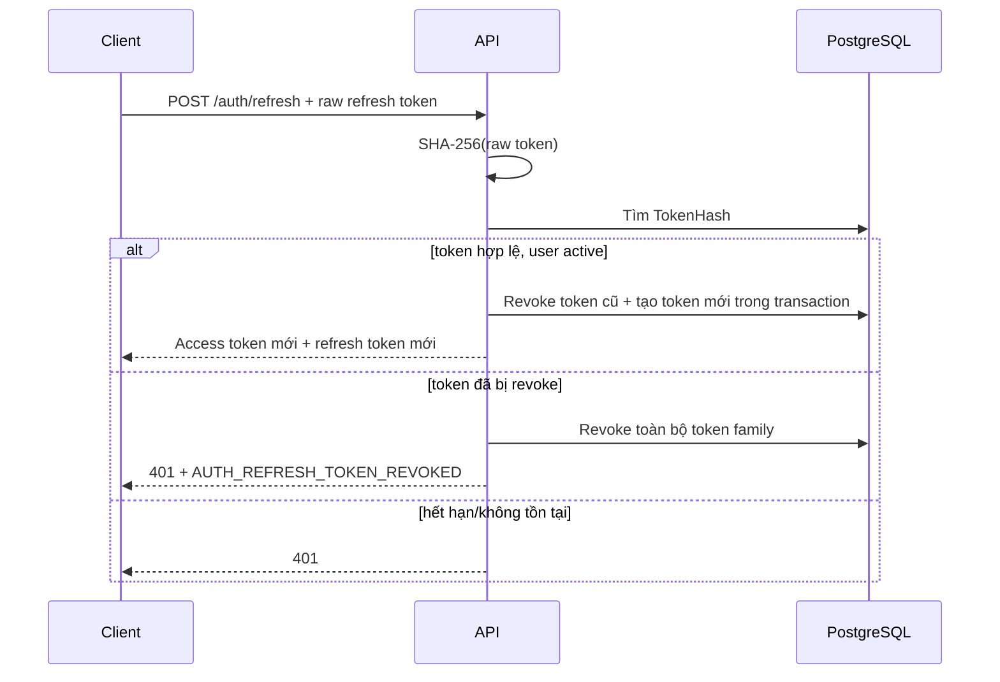
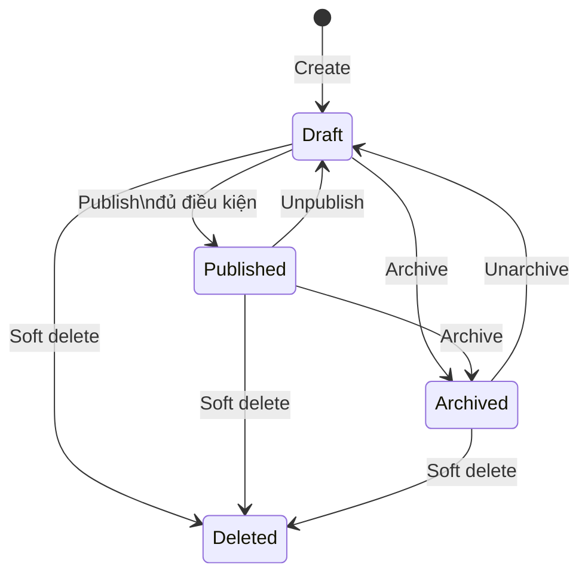
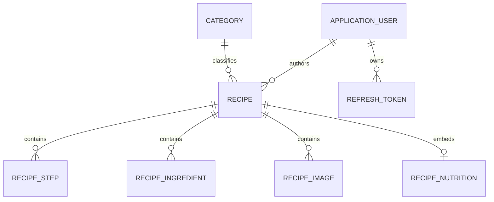
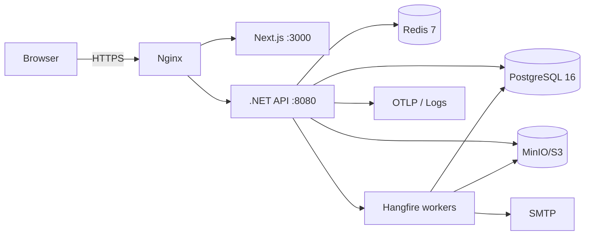

# Phân tích triển khai dự án Culinary Blog

> Tài liệu nguồn: [SRS_Culinary_Blog_v1.0.0.pdf](./SRS_Culinary_Blog_v1.0.0.pdf)  
> Phiên bản SRS: 1.0.0 — Approved — 04/06/2026  
> Ngày phân tích: 09/09/2026  
> Baseline giải mâu thuẫn: Accepted — 11/09/2026 — [SRS Conformance and Conflict Resolution](./phase-0/00_SRS_Conformance_and_Resolution.md)  
> Mục tiêu: chuyển SRS thành baseline đủ rõ để thiết kế, phát triển, kiểm thử và triển khai một dự án hoàn chỉnh.

## 1. Kết luận tổng quan

Culinary Blog là ứng dụng web full-stack theo kiến trúc API-driven, cho phép khách khám phá công thức và cho phép tác giả tạo, quản lý, xuất bản công thức của mình. Quản trị viên quản lý danh mục và có quyền thao tác trên mọi công thức.

Baseline công nghệ bắt buộc theo SRS:

- Backend: .NET 10 Minimal APIs, C#, Clean Architecture, CQRS và MediatR.
- Frontend: Next.js App Router, TypeScript, Tailwind CSS, TanStack Query, React Hook Form và Zod.
- Cơ sở dữ liệu: PostgreSQL 16, EF Core Code First.
- Cache/rate-limit state: Redis 7.
- Lưu trữ ảnh: MinIO tương thích S3.
- Background jobs: Hangfire, lưu queue trong PostgreSQL.
- Xác thực: ASP.NET Core Identity, JWT access token, refresh-token rotation, Google OAuth 2.0/OIDC.
- Quan sát hệ thống: Serilog, OpenTelemetry, health checks; Seq ở development và OTLP-compatible backend ở production.
- Đóng gói/triển khai: Docker multi-stage, Docker Compose, Nginx reverse proxy và TLS termination.

SRS là nguồn yêu cầu cốt lõi. Các đoạn tự mâu thuẫn trong PDF đã được chốt bằng baseline ngày 11/09/2026; vị trí, hai vế mâu thuẫn, quyết định và lý do được ghi tại tài liệu Conformance. Từ thời điểm này, SRS cộng với baseline giải mâu thuẫn là contract bắt buộc cho code, OpenAPI và test.

## 2. Phạm vi sản phẩm

### 2.1. Trong phạm vi phiên bản 1.0

- Đăng ký, đăng nhập email/mật khẩu và Google.
- JWT access token, refresh token, rotation, reuse detection và logout.
- Xem/cập nhật hồ sơ cá nhân.
- Xem và quản trị danh mục công thức.
- CRUD công thức; quản lý trạng thái Draft, Published, Archived.
- Quản lý nguyên liệu, các bước thực hiện, ảnh và thông tin dinh dưỡng.
- Tìm kiếm toàn văn tiếng Việt, lọc, sắp xếp và phân trang.
- Upload/xóa ảnh qua MinIO; sinh ảnh medium và thumbnail bất đồng bộ.
- Email chào mừng, sinh sitemap theo lịch.
- Cache, rate limiting, structured logging, tracing, metrics và health checks.
- Giao diện responsive, accessible và tối ưu SEO cho nội dung công khai.

### 2.2. Ngoài phạm vi phiên bản 1.0

- Bình luận và đánh giá sao.
- Lưu công thức yêu thích/bookmark.
- Thông báo real-time.
- Ứng dụng native iOS/Android.
- Thanh toán và thương mại điện tử.
- Nhắn tin trực tiếp giữa người dùng.
- GraphQL API.
- Gợi ý công thức bằng AI/ML.
- Đa ngôn ngữ hoàn chỉnh.
- Social sharing nâng cao ngoài Open Graph/meta tags.

Những tính năng ngoài phạm vi không nên tạo entity, endpoint hoặc UI giả trong v1; chỉ nên giữ các extension point hợp lý.

## 3. Tác nhân, quyền và nguyên tắc truy cập

### 3.1. Tác nhân

| Tác nhân | Bản chất | Quyền chính |
|---|---|---|
| Guest | Người chưa xác thực; không phải role lưu trong DB | Xem Published recipe, category, tìm kiếm và phân trang |
| Author | Role mặc định của tài khoản mới | Quyền Guest và CRUD/publish/archive recipe do mình sở hữu; quản lý ảnh, nguyên liệu, bước thực hiện; sửa hồ sơ |
| Admin | Role được seed/gán có kiểm soát | Toàn bộ quyền Author; quản lý category; thao tác mọi recipe; truy cập dashboard jobs/logs phù hợp |
| System/Worker | Hangfire và recurring scheduler | Gửi email, xử lý ảnh, xóa object, tạo sitemap, retry job |
| External provider | Google, SMTP, MinIO, Redis, PostgreSQL, OTLP backend | Cung cấp dịch vụ phụ thuộc cho ứng dụng |

### 3.2. Ma trận quyền nghiệp vụ

| Nghiệp vụ | Guest | Author | Admin |
|---|:---:|:---:|:---:|
| Xem category/Published recipe | Có | Có | Có |
| Tìm kiếm Published recipe | Có | Có | Có |
| Xem Draft/Archived | Không | Chỉ của mình | Mọi recipe |
| Tạo recipe | Không | Có | Có |
| Sửa/xóa/publish/archive recipe | Không | Chỉ của mình | Mọi recipe |
| Quản lý ảnh/ingredient/step | Không | Chỉ recipe của mình | Mọi recipe |
| Sửa hồ sơ của mình | Không | Có | Có |
| CRUD category | Không | Không | Có |
| Hangfire dashboard | Không | Không | Có |
| Xem log/telemetry | Không | Không | Theo quyền vận hành, không nên chỉ dựa vào role ứng dụng |

### 3.3. Ba lớp kiểm soát bắt buộc

1. **Authentication** xác minh JWT và trạng thái tài khoản.
2. **Role/policy authorization** giới hạn nhóm endpoint (`AuthorPolicy`, `AdminPolicy`).
3. **Resource authorization** kiểm tra `Recipe.AuthorId == CurrentUser.Id`, Admin được bypass.

Kiểm tra quyền phải tồn tại cả ở endpoint và Application handler. Query công khai tuyệt đối không được trả Draft/Archived vì có token tùy chọn nếu cache dùng chung cho public.

## 4. Phân rã miền nghiệp vụ

| Module | Trách nhiệm | Thành phần chính |
|---|---|---|
| Identity & Access | Vòng đời tài khoản và token | ApplicationUser, Identity roles, RefreshToken |
| Category | Phân loại và navigation | Category |
| Recipe | Aggregate trung tâm và vòng đời nội dung | Recipe, RecipeNutrition |
| Recipe Composition | Nội dung chi tiết | RecipeIngredient, RecipeStep, RecipeImage |
| Discovery | Listing, filter, sort, search | PostgreSQL FTS, pagination, cache |
| File Storage | Kiểm tra và lưu object | MinIO/S3, metadata ảnh |
| Jobs | Công việc ngoài request cycle | Welcome email, resize, delete object, sitemap |
| Observability | Vận hành và chẩn đoán | Health, logs, traces, metrics |

Ranh giới transaction: Recipe là aggregate root. Thay đổi recipe cùng các ingredient/step được commit qua một Unit of Work; upload object và gửi job là side effect ngoài database transaction nên cần cơ chế bù/retry.

## 5. Luồng nghiệp vụ chi tiết

### 5.1. Đăng ký tài khoản

1. Guest gửi tên hiển thị, email và mật khẩu.
2. Validate format, độ dài và password policy.
3. Chuẩn hóa email; kiểm tra unique bằng cả logic ứng dụng và unique index của Identity.
4. Tạo `ApplicationUser`, hash mật khẩu bằng ASP.NET Core Identity.
5. Gán role `Author`.
6. Tạo access token và refresh token; chỉ lưu SHA-256 hash của refresh token.
7. Commit user, role và refresh token.
8. Enqueue welcome-email job sau khi commit thành công.
9. Trả `201 Created` cùng thông tin user và phiên đăng nhập theo contract đã chốt.

Ngoại lệ quan trọng: email trùng; password yếu; lỗi transaction; enqueue email thất bại. Email thất bại không được rollback tài khoản và phải có retry/quan sát job.

### 5.2. Đăng nhập cục bộ

1. Validate email/password và áp dụng rate limit auth.
2. Tìm user theo normalized email nhưng trả lỗi generic nếu không tìm thấy.
3. Kiểm tra `IsActive`, lockout và password.
4. Tăng access-failed count khi sai; khóa 15 phút sau 5 lần sai.
5. Khi đúng, reset failed count, lấy roles, tạo cặp token và lưu hash refresh token.
6. Trả phiên đăng nhập; không log password hoặc raw token.

### 5.3. Đăng nhập Google

Baseline đã chốt là **Authorization Code Flow + PKCE do Auth.js thực hiện**, sau đó backend nhận và xác minh Google ID token. Quyết định này giải mâu thuẫn giữa `ExternalLoginInfo`, `idToken` và callback backend trong PDF.

Luồng mục tiêu:

1. Frontend mở Google authorization với `openid email profile` và PKCE.
2. Auth.js xử lý callback, xác minh state/nonce và lấy ID token.
3. Frontend gửi ID token đến `POST /api/v1/auth/google`.
4. Backend xác minh chữ ký, issuer, audience, expiry và `email_verified` với thư viện Google chính thức.
5. Tìm external login theo provider key; nếu chưa có, tìm user theo normalized email.
6. Liên kết external login với user hiện có hoặc tạo user mới và role Author.
7. Tạo cặp token nội bộ; không sử dụng Google access token làm token của Culinary Blog.

### 5.4. Refresh token rotation và reuse detection



Các rule bắt buộc:

- Access token TTL 15 phút; refresh token TTL 7 ngày.
- Raw refresh token chỉ xuất hiện ở client; DB chỉ lưu hash.
- Rotation và revoke token cũ phải cùng transaction với tạo token mới.
- Mỗi token cần family identifier hoặc chuỗi liên kết đủ tin cậy để revoke family.
- Logout idempotent: token không tồn tại/đã revoke vẫn trả `204` nếu request hợp lệ.
- Refresh token được gửi trong request body đúng Chương 5/8 của SRS, lưu ở `sessionStorage`; access token giữ trong memory. Không dùng `localStorage`. CSP, output encoding và không log token là kiểm soát bắt buộc cho rủi ro XSS.

### 5.5. Vòng đời Recipe



Baseline vòng đời:

- Recipe mới luôn là `Draft`, thuộc user tạo.
- Draft/Archived chỉ owner hoặc Admin được đọc.
- Published được public và được đưa vào search/sitemap/ISR.
- Slug sinh từ title, unique; sau lần publish đầu tiên không đổi.
- Publish yêu cầu title/description/category hợp lệ, ít nhất 1 ingredient và 1 step. Không bắt buộc ảnh; khi chưa có ảnh, frontend dùng asset mặc định cho card/OG/JSON-LD.
- Unpublish đưa về Draft, gỡ khỏi public cache/search/sitemap ở lần cập nhật kế tiếp.
- Archive ẩn khỏi public nhưng giữ dữ liệu.
- Delete Recipe là soft delete để phù hợp BaseEntity, Chương 8 và NFR durability. V1 không có purge vật lý; child metadata và object được giữ nhưng không được lộ qua query/cache/media delivery.
- Mọi mutation phải invalidate các key/tag: listing, recipe slug, category, search liên quan và revalidation frontend.

### 5.6. Tạo/cập nhật công thức

1. Author tạo phần thông tin cơ bản; hệ thống xác minh category và sinh slug.
2. Lưu Draft và trả ID/slug/concurrency token.
3. Author thêm/sắp xếp ingredient và step, cập nhật nutrition.
4. Author upload ảnh; ảnh đầu tiên trở thành primary nếu chưa có primary.
5. Mỗi write kiểm tra ownership và concurrency token.
6. Client lưu nháp theo từng bước của wizard; lỗi một bước không làm mất dữ liệu các bước đã commit.
7. Khi publish, domain service kiểm tra toàn bộ invariant.

Với `PUT /recipes/{id}`, client gửi `If-Match` chứa ETag/concurrency token. Khi conflict, API trả lỗi thống nhất và frontend yêu cầu reload/merge; không âm thầm last-write-wins.

### 5.7. Quản lý ingredient và step

- Ingredient: name bắt buộc; quantity và unit phải được chốt là nullable theo data model hay bắt buộc theo FR. Baseline hỗ trợ “vừa đủ” bằng `Quantity = null`, `Unit = null`.
- `OrderIndex` quyết định thứ tự ingredient; không trộn tên `SortOrder`.
- Step có `StepNumber` duy nhất trong một recipe, bắt đầu từ 1 và liên tục.
- Thêm step mặc định vào cuối.
- Xóa/reorder step phải thực hiện trong transaction và tránh vi phạm unique `(RecipeId, StepNumber)` trong lúc renumber; có thể dùng temporary offset hoặc cập nhật hai pha.
- Nếu Published recipe bị xóa hết step/ingredient thì mutation phải bị từ chối hoặc recipe tự chuyển Draft. Khuyến nghị từ chối với domain error rõ ràng.

### 5.8. Quản lý ảnh

1. Kiểm tra ownership trước khi đọc file.
2. Kiểm tra `Content-Length`/stream limit tối đa 5 MB.
3. Allowlist JPEG, PNG, WebP, AVIF; xác minh magic bytes/decode thực tế, không tin extension hoặc header.
4. Sinh object key từ GUID, không dùng tên file do user cung cấp.
5. Upload original; chỉ tạo DB record sau khi upload thành công. Nếu DB commit fail, enqueue cleanup object mồ côi.
6. Enqueue resize job tạo medium 800×600 và thumbnail 300×300.
7. Chỉ một ảnh primary cho mỗi recipe; enforce bằng transaction và partial unique index nếu khả thi.
8. Xóa metadata trước/đồng thời enqueue xóa object idempotent; nếu xóa primary, chọn ảnh kế tiếp.

Bucket được chốt là private vì yêu cầu `public-read` mâu thuẫn với quyền riêng tư của Draft/Archived. Published asset được serve qua CDN/proxy có kiểm soát; private asset dùng presigned URL ngắn hạn sau authorization.

### 5.9. Category

- Public listing trả category chưa bị xóa kèm số Published recipe.
- Admin tạo category; slug unique và ổn định sau khi tạo.
- Đổi name không đổi slug để tránh broken link.
- Không xóa category còn bất kỳ recipe nào, kể cả Draft/Archived/soft-deleted tùy retention rule.
- Category delete là soft delete; name/slug vẫn unique toàn bảng để không tái sử dụng URL của nội dung đã xóa.
- Invalidate category/listing/navigation cache sau mutation.

### 5.10. Tìm kiếm, lọc, sort và phân trang

- Chỉ index/trả Published recipe trên endpoint public.
- `q` tối thiểu 2 ký tự; normalize khoảng trắng và sanitize biểu thức tsquery.
- Tiếng Việt dùng PostgreSQL `simple` configuration + `unaccent` + prefix matching; `pg_trgm` hỗ trợ fuzzy title search. Custom Vietnamese dictionary nằm ngoài v1.
- GIN index cho search vector; `pg_trgm` hỗ trợ typo/fuzzy search nếu được dùng.
- Filter kết hợp AND: category, difficulty, max cook time, min servings.
- Sort allowlist, mặc định `createdAt desc`; không chuyển trực tiếp field do client gửi thành SQL.
- Offset pagination: page mặc định 1, pageSize mặc định 12, tối đa 50.
- Query không có kết quả trả `200` với danh sách rỗng.
- Với quy mô ban đầu tối đa 10.000 recipe, offset pagination phù hợp; chuyển cursor khi dữ liệu lớn hoặc page sâu gây chậm.

## 6. Quy tắc nghiệp vụ hợp nhất

| Mã phân tích | Quy tắc baseline |
|---|---|
| BR-001 | Email normalized là duy nhất; lỗi không tiết lộ user có tồn tại trong luồng login |
| BR-002 | User đăng ký mới nhận role Author; Admin chỉ được seed/gán qua quy trình đặc quyền |
| BR-003 | User `IsActive=false` không được login, refresh hoặc thực hiện request đã xác thực |
| BR-004 | Author chỉ thao tác recipe có `AuthorId` của mình; Admin bypass ownership |
| BR-005 | Recipe mới là Draft; public chỉ đọc Published |
| BR-006 | Slug unique; recipe slug bất biến sau publish đầu tiên |
| BR-007 | Publish chỉ thành công khi aggregate đạt điều kiện hoàn chỉnh đã chốt |
| BR-008 | Mỗi recipe có tối đa một primary image |
| BR-009 | StepNumber liên tục từ 1 và unique trong recipe |
| BR-010 | Category có recipe không được xóa |
| BR-011 | Refresh token dùng một lần; reuse làm revoke cả family |
| BR-012 | Xóa file/object là idempotent và retry được |
| BR-013 | Mọi write có audit context: user, timestamp, correlation/trace ID |
| BR-014 | Cache không được làm rò Draft/Archived hoặc dữ liệu của user khác |
| BR-015 | Soft-deleted record bị loại bằng EF Core global query filter; truy vấn quản trị phải opt-in rõ ràng |

## 7. Mô hình dữ liệu baseline

### 7.1. Quan hệ chính



### 7.2. Entity và invariant đáng chú ý

| Entity | Thuộc tính chính | Index/constraint quan trọng |
|---|---|---|
| ApplicationUser | string Id, Email, DisplayName, AvatarUrl, Bio, IsActive, CreatedAt | unique normalized email/username từ Identity |
| RefreshToken | Id, UserId, TokenHash, FamilyId, ExpiresAt, RevokedAt, ReplacedByTokenHash, CreatedAt, CreatedByIp | unique TokenHash; index UserId/FamilyId/expiry |
| Category | Guid Id, Name, Slug, Description, ImageUrl, OrderIndex, audit/soft-delete | unique toàn bảng cho slug/name; index OrderIndex |
| Recipe | Guid Id, Title, Slug, Description, Instructions, times, servings, Difficulty, Status, CategoryId, AuthorId, SearchVector, PublishedAt, audit/soft-delete/concurrency | unique slug; indexes status/category/author/publishedAt; GIN SearchVector |
| RecipeNutrition | Calories, Protein, Carbohydrates, Fat, Fiber, Sodium | owned columns trên Recipe |
| RecipeStep | RecipeId, StepNumber, Title, Description, TimerMinutes, ImageUrl | unique `(RecipeId, StepNumber)` |
| RecipeIngredient | RecipeId, Name, Quantity, Unit, Notes, OrderIndex | index `(RecipeId, OrderIndex)` |
| RecipeImage | RecipeId, OriginalUrl, MediumUrl, ThumbnailUrl, AltText, IsPrimary, OrderIndex | index `(RecipeId, OrderIndex)`; unique partial primary |

### 7.3. Quyết định kỹ thuật dữ liệu đã chốt để giải mâu thuẫn SRS

- PostgreSQL không có SQL Server-style `rowversion`; baseline dùng `Version bigint` tăng nguyên tử ở mỗi mutation aggregate và map ETag/If-Match.
- `ApplicationUser` và `RefreshToken` không nên bị ép kế thừa BaseEntity nếu key/lifecycle khác; khai báo audit fields riêng.
- Soft delete vẫn dùng unique index toàn bảng; không tái sử dụng slug/name của record đã xóa để bảo toàn URL và tránh nhầm nội dung.
- Thêm `FamilyId` cho RefreshToken để reuse detection có định nghĩa thực thi được.
- Dùng Outbox table để email/resize/delete/sitemap event không bị mất giữa DB commit và enqueue.

## 8. Thiết kế API hợp nhất

### 8.1. Quy ước

- Base path: `/api/v1`.
- JSON UTF-8; upload dùng multipart/form-data.
- Bearer JWT cho endpoint yêu cầu xác thực.
- Error dùng RFC 7807 Problem Details và application error code ổn định.
- Pagination dùng một schema duy nhất:

```json
{
  "data": [],
  "meta": {
    "page": 1,
    "pageSize": 12,
    "total": 0,
    "totalPages": 0,
    "hasNextPage": false,
    "hasPreviousPage": false
  }
}
```

- Validation syntactic/field/business precondition và thiếu `If-Match`: `400 Bad Request`.
- Optimistic concurrency stale version: `409 Conflict`.
- `X-Correlation-ID` nhận hoặc sinh tại edge, trả lại response và đưa vào Problem Details/log.
- `ETag` trên read/update recipe và `If-Match` trên mutation cần concurrency.

### 8.2. Endpoint inventory

| Module | Method/path | Quyền | Kết quả chính |
|---|---|---|---|
| Auth | `POST /auth/register` | Public | 201; tạo Author và phiên |
| Auth | `POST /auth/login` | Public | 200; tạo phiên |
| Auth | `POST /auth/google` | Public | 200; link/tạo user và phiên |
| Auth | `POST /auth/refresh` | Refresh token | 200; rotate token |
| Auth | `POST /auth/logout` | Phiên/token hợp lệ theo contract | 204; revoke idempotent |
| Auth | `GET /auth/me` | Authenticated | 200; profile |
| Auth | `PATCH /auth/me` | Authenticated | 200; profile mới |
| Category | `GET /categories` | Public | Danh sách category |
| Category | `GET /categories/{slug}` | Public | Category + Published recipes |
| Category | `POST /categories` | Admin | 201 |
| Category | `PUT /categories/{id}` | Admin | 200 |
| Category | `DELETE /categories/{id}` | Admin | 204/409 |
| Recipe | `GET /recipes` | Public | Published listing |
| Recipe | `GET /recipes/{slug}` | Public | Chỉ Published detail |
| Recipe | `GET /recipes/search` | Public | Published search |
| Recipe | `GET /me/recipes` | Authenticated | Recipe của current user, mọi trạng thái |
| Recipe | `GET /me/recipes/{id}` | Owner | Private detail/preview |
| Recipe | `GET /admin/recipes` | Admin | Mọi Recipe, mọi owner/trạng thái |
| Recipe | `GET /admin/recipes/{id}` | Admin | Private detail bất kỳ Recipe |
| Recipe | `POST /recipes` | Author/Admin | 201 Draft |
| Recipe | `PUT /recipes/{id}` | Owner/Admin | 200; concurrency checked |
| Recipe | `PATCH /recipes/{id}/publish` | Owner/Admin | 200 |
| Recipe | `PATCH /recipes/{id}/unpublish` | Owner/Admin | 200 |
| Recipe | `PATCH /recipes/{id}/archive` | Owner/Admin | 200 |
| Recipe | `PATCH /recipes/{id}/unarchive` | Owner/Admin | 200; cần bổ sung để đúng tên FR |
| Recipe | `DELETE /recipes/{id}` | Owner/Admin | 204 soft delete |
| Image | `POST /recipes/{id}/images` | Owner/Admin | 201 |
| Image | `PATCH /recipes/{id}/images/{imageId}` | Owner/Admin | Sửa alt/primary/order |
| Image | `DELETE /recipes/{id}/images/{imageId}` | Owner/Admin | 204 |
| Step | `POST /recipes/{id}/steps` | Owner/Admin | 201 |
| Step | `PUT /recipes/{id}/steps/{stepId}` | Owner/Admin | 200 |
| Step | `DELETE /recipes/{id}/steps/{stepId}` | Owner/Admin | 204 |
| Ingredient | `POST /recipes/{id}/ingredients` | Owner/Admin | 201 |
| Ingredient | `PUT /recipes/{id}/ingredients/{ingredientId}` | Owner/Admin | 200 |
| Ingredient | `DELETE /recipes/{id}/ingredients/{ingredientId}` | Owner/Admin | 204 |
| Health | `GET /health/live` | Probe | Process alive |
| Health | `GET /health/ready` | Probe | DB/Redis readiness |
| Health | `GET /health` | Ops/internal | Aggregate details |

Để tránh cache/authorization leakage, baseline dùng `/me/recipes` cho owner dashboard và `/admin/recipes` cho Admin. `GET /recipes` công khai chỉ trả Published, không thay đổi response dựa trên bearer token tùy chọn.

## 9. Frontend và luồng màn hình

| Route | Rendering | Dữ liệu/chức năng |
|---|---|---|
| `/` | ISR | Featured Published recipes, categories |
| `/recipes` | SSR | Listing/filter/sort; search điều hướng rõ ràng |
| `/recipes/[slug]` | ISR cho Published; dynamic/private cho preview | Detail, ingredients, steps, nutrition, JSON-LD |
| `/categories` | ISR | Category navigation |
| `/categories/[slug]` | ISR | Chỉ Published recipes của category |
| `/search` | SSR | Search results; query trong URL |
| `/auth/login` | CSR | Local login và Google |
| `/auth/register` | CSR | Registration |
| `/profile` | CSR/private | Xem/sửa profile |
| `/dashboard` | CSR/private | Tổng quan Author/Admin |
| `/dashboard/recipes` | CSR/private | Recipe của user; Draft/Published/Archived |
| `/dashboard/recipes/new` | CSR/private | Multi-step creation wizard |
| `/dashboard/recipes/[id]/edit` | CSR/private | Edit, image, ingredient, step, publish |
| `/dashboard/categories` | CSR/Admin | Category CRUD |

Luồng wizard baseline:

1. Thông tin cơ bản và nutrition.
2. Ingredient.
3. Step.
4. Images và primary image.
5. Preview và publish validation.

Frontend cần route guard để cải thiện UX, nhưng backend vẫn là nguồn kiểm soát quyền. TanStack Query cache key phải bao gồm query/filter/user scope. Khi access token hết hạn, chỉ một refresh request được chạy; các request khác chờ cùng promise để tránh rotation race.

ISR cache không được dùng cho nội dung personalized. Preview Draft/Archived nên dùng route private/dynamic hoặc preview mode, không trộn với cache của trang Published.

## 10. Kiến trúc triển khai

### 10.1. Backend Clean Architecture

```text
backend/src/
├── CulinaryBlog.Domain/          # Entity, value object, enum, domain rule/event
├── CulinaryBlog.Application/     # CQRS, handler, validator, DTO, ports
├── CulinaryBlog.Infrastructure/  # EF Core, Identity, Redis, S3, SMTP, Hangfire
└── CulinaryBlog.Api/             # Minimal endpoints, auth, middleware, OpenAPI
backend/tests/
├── CulinaryBlog.Domain.Tests/
├── CulinaryBlog.Application.Tests/
├── CulinaryBlog.IntegrationTests/
└── CulinaryBlog.ArchitectureTests/
```

Dependency: Domain độc lập; Application chỉ tham chiếu Domain; Infrastructure và API tham chiếu Application theo composition root. Domain không nên tham chiếu FluentValidation; validator thuộc Application.

Pipeline hợp lý:

1. Correlation/tracing ở HTTP middleware.
2. Authentication/rate limiting/authorization ở edge phù hợp.
3. MediatR logging/performance.
4. Validation.
5. Query caching nếu có.
6. Handler/transaction.
7. Cache invalidation/outbox sau commit.

### 10.2. Hạ tầng runtime



Các service Docker Compose: `nginx`, `frontend`, `api`, `postgres`, `redis`, `minio`; development thêm `seq`, `mailhog` và có thể thêm MinIO bootstrap service tạo bucket.

Không dùng tag `latest` ở production. Pin image version/digest, chạy container non-root nếu image hỗ trợ, thêm healthcheck và resource limit. Secrets chỉ qua user-secrets ở local và secret store/environment ở deployment; không commit `.env` thật.

### 10.3. Cấu hình môi trường

| Nhóm | Development | Test/CI | Production |
|---|---|---|---|
| API | hot reload, Debug logs | ephemeral container | Release, structured JSON logs |
| DB | PostgreSQL Docker + seed | Testcontainers/isolated DB | managed/VPS PostgreSQL + backup |
| Redis | Docker | isolated Redis | persistent/AOF hoặc managed Redis |
| Object storage | MinIO Docker | isolated bucket | MinIO/S3, persistent/private |
| Email | MailHog | fake/spies | SMTP provider |
| OAuth | local callback credentials | mocked provider | production credentials |
| Telemetry | Seq/console | captured/no-op | OTLP collector/Grafana stack |
| TLS | có thể HTTP localhost | internal | TLS 1.2+ tại Nginx |

Baseline dùng .NET 10 SDK, Node 20 LTS được khóa trong `.nvmrc`/Volta, npm 10+, Docker Desktop/Engine và Git 2.40+. Production tối thiểu 2 vCPU, 4 GB RAM, 50 GB SSD; development full stack cần 8 GB RAM và 20 GB trống.

## 11. Cache, consistency và background jobs

### 11.1. Cache baseline

SRS mâu thuẫn giữa IMemoryCache, Output Cache và Redis. Để stateless/horizontal scale:

- Redis là shared data cache duy nhất cho dữ liệu dùng giữa nhiều API instance.
- Có thể dùng .NET Output Cache với Redis-backed store; không dùng per-node memory cho response chứa dữ liệu thay đổi/quyền.
- Public category list: TTL 30 phút.
- Public recipe detail: TTL 5 phút.
- Public recipe list: TTL 15 phút.
- Search: TTL 1 phút hoặc không cache cho truy vấn ít lặp.
- Không cache private Draft/Archived trong shared public key.
- Write thành công phải invalidate theo tag/key sau commit; nếu invalidation fail, TTL là safety net và phải log/metric.

### 11.2. Jobs và độ tin cậy

| Job | Trigger | Retry | Failure behavior |
|---|---|---|---|
| Welcome email | User commit thành công | 3 lần, exponential | User vẫn được tạo; failed job có alert |
| Image resize | Original + metadata commit | 3 lần | Original vẫn hiển thị |
| Object delete | Xóa image riêng lẻ; future hard purge chỉ qua Change Request | 3 lần, idempotent | Ghi nhận orphan để quét lại |
| Sitemap generation | 02:00 UTC hàng ngày và có thể debounce sau publish | 2 lần | Giữ sitemap gần nhất |
| Backup | Hạ tầng scheduler, không nên phụ thuộc API process | theo runbook | Alert, không xóa bản backup tốt gần nhất |

Hangfire dùng PostgreSQL nên queued job có persistence; việc API/job server tạm dừng không đồng nghĩa fire-and-forget job bị mất nếu enqueue đã commit. Outbox pattern là lựa chọn nên triển khai để đóng khoảng trống dual-write.

## 12. Yêu cầu phi chức năng và cách nghiệm thu

| Nhóm | Mục tiêu SRS | Cách kiểm chứng |
|---|---|---|
| API latency | GET cache p50 ≤150 ms; mọi API p95 ≤500 ms; p99 ≤1 s | k6 với dataset/host chuẩn, warm-up và report percentile |
| Throughput | ≥100 concurrent users trên 2 vCPU/4 GB | smoke → load → stress test |
| Cache | hit rate ≥80% steady state | Redis/app metrics và dashboard |
| Frontend | LCP ≤2.5 s; CLS ≤0.1; INP ≤200 ms; JS gzip ≤200 KB | Lighthouse CI + Web Vitals RUM |
| Security | OWASP Top 10, TLS 1.2+, CORS allowlist, rate limits | security tests, dependency/secret scan, ZAP/manual review |
| Accessibility | WCAG 2.1 AA | axe, keyboard test, NVDA/VoiceOver |
| Reliability | uptime ≥99.5% | external uptime monitor và SLO dashboard |
| Durability | daily backup, giữ 30 ngày, persistent volumes | restore drill định kỳ, không chỉ kiểm tra file backup tồn tại |
| Maintainability | static analysis sạch; architecture rules | build warnings-as-errors, analyzers, architecture tests |
| Coverage | unit ≥80%; mọi API có happy/error; 5 E2E critical flows | CI coverage gate và Playwright |
| SEO | JSON-LD Recipe, canonical/OG, sitemap/robots | Rich Results validator, crawler test, metadata snapshots |

Mọi con số hiệu năng phải kèm test profile: cấu hình máy, số record, tỷ lệ read/write, cache state, payload/ảnh và network. Nếu không, pass/fail không tái lập được.

## 13. Chiến lược kiểm thử

### 13.1. Unit/domain

- Recipe state transition và publish invariant.
- Slug generation/uniqueness policy.
- Ownership policy.
- Token validity/rotation/reuse rules.
- Validators, filter/sort allowlist, pagination bounds.
- Step renumber và primary-image invariant.

### 13.2. Integration API

- Dùng PostgreSQL/Redis/MinIO thật qua Testcontainers, không thay PostgreSQL bằng in-memory provider.
- Mỗi endpoint: happy path, validation, unauthenticated, forbidden/ownership, not found, conflict.
- EF global filters, cascade/soft-delete semantics, GIN search và unaccent.
- Concurrent update và concurrent refresh-token request.
- Upload spoofed MIME/magic bytes, oversized stream, object cleanup.
- Cache hit/miss/invalidation và không rò dữ liệu private.
- Problem Details schema/error code/correlation ID.

### 13.3. E2E bắt buộc

1. Register → auto-login → profile.
2. Login → refresh → logout → refresh cũ bị từ chối.
3. Tạo Draft qua wizard → upload ảnh → thêm ingredient/step.
4. Publish → xuất hiện ở listing/detail/search/sitemap metadata.
5. Author khác không sửa được recipe; Admin sửa được.

Nên bổ sung E2E accessibility, responsive breakpoints và SEO metadata cho Published/Draft.

## 14. Mâu thuẫn, khoảng trống và quyết định đã khóa

### 14.1. Mâu thuẫn trong SRS

Toàn bộ GAP-001–033 đã được chốt. Bảng dưới đây là bản tóm tắt; vị trí trang/mục và lý do đầy đủ nằm trong [00_SRS_Conformance_and_Resolution.md](./phase-0/00_SRS_Conformance_and_Resolution.md). Không còn lựa chọn mở cho implementation.

| ID | Vấn đề | Ảnh hưởng | Baseline/việc cần quyết định |
|---|---|---|---|
| GAP-001 | SRS nói 27 FR nhưng tổng nhóm 7+5+10+4+2+3+3 = 34 | Traceability/coverage sai | Dùng 34 FR và giữ toàn bộ mã đã liệt kê |
| GAP-002 | Validation lúc dùng 400, lúc 422 | Frontend/tests/OpenAPI lệch | Dùng 400 cho validation/domain precondition |
| GAP-003 | Concurrency conflict lúc 409, application code table ghi 422 | Contract không ổn định | Baseline 409 Conflict |
| GAP-004 | Register dùng `fullName`/`userName`, API table dùng `displayName`; data model chỉ có `DisplayName` | DTO/schema không thống nhất | Dùng `displayName`, `email`, `password`; Identity username dùng normalized email nội bộ |
| GAP-005 | Google flow mô tả code+PKCE, ExternalLoginInfo, ID token và callback ở hai nơi khác nhau | Rủi ro auth/integration | Auth.js sở hữu callback; backend verify ID token |
| GAP-006 | RefreshToken FR dùng `IsRevoked`/`ReplacedByToken`; data model dùng `RevokedAt`/hash | Implementation lệch schema | Dùng `RevokedAt`, `TokenHash`, `ReplacedByTokenHash`, thêm FamilyId |
| GAP-007 | Logout yêu cầu bearer hợp lệ nhưng luồng phụ cho access token hết hạn | Người dùng có thể không logout được | Cho phép revoke bằng refresh token và bảo vệ bằng token ownership; contract phải ghi rõ |
| GAP-008 | Recipe delete được mô tả hard delete, soft delete và BaseEntity/NFR lại yêu cầu soft delete | Mất dữ liệu, object retention | Soft delete; không hard purge trong v1 |
| GAP-009 | Category delete lúc “xóa khỏi DB”, API nói soft delete | Data semantics | Baseline soft delete |
| GAP-010 | Publish có nơi chỉ cần step, nơi cần ingredient + step | Domain invariant | Bắt buộc ingredient + step; không bắt buộc ảnh |
| GAP-011 | FR “Archive/Unarchive” nhưng chỉ có archive endpoint/flow | Không khôi phục trạng thái | Bổ sung `/unarchive`, chuyển Archived về Draft |
| GAP-012 | Image API table dùng PATCH metadata; FR chi tiết dùng `/primary` riêng | Endpoint/UI lệch | Baseline PATCH metadata duy nhất, atomic primary switch |
| GAP-013 | Cache category: memory 60 phút/Redis 30 phút; recipe: 60/15/5 phút; search: không cache/5/1 phút | Scale và stale data | Redis-backed; TTL category/detail/list/search = 30/5/15/1 phút |
| GAP-014 | Public listing/category có response personalized theo optional auth nhưng lại cache public/ISR | Rò Draft của owner hoặc cache poisoning | Public endpoint chỉ Published; dashboard endpoint riêng |
| GAP-015 | PostgreSQL `RowVersion bytea [Timestamp]` không có cơ chế auto-version như SQL Server | Concurrency có thể không hoạt động | Dùng application-managed `Version bigint` |
| GAP-016 | Search gọi config `vietnamese` nhưng PostgreSQL chuẩn không đảm bảo có config này | Migration/runtime fail | Dùng `simple + unaccent`, GIN và `pg_trgm` fallback |
| GAP-017 | Step dùng `Title/TimerMinutes` ở data/API, `Description/DurationMinutes` ở FR | DTO/entity mismatch | Dùng schema data/API: title, description, timerMinutes |
| GAP-018 | Ingredient dùng `OrderIndex` ở data/API, `SortOrder` ở FR | Mapping/sort lỗi | Chuẩn hóa `orderIndex` |
| GAP-019 | Category name DB 100 ký tự, validator 50; CookTime DB cho 0 nhưng validator yêu cầu >0 | Validation không nhất quán | Category max 100; cookTime ≥0 để hỗ trợ no-cook |
| GAP-020 | Profile API có `bio`, FR chi tiết chỉ cho fullName/avatar; FullName vs DisplayName | UI/DTO lệch | Cho phép `displayName`, `avatarUrl`, `bio` |
| GAP-021 | Response pagination có `items/totalCount` và `data/meta` | Client SDK khó ổn định | Dùng `data/meta` thống nhất |
| GAP-022 | Bucket MinIO public-read nhưng Draft/Archived cần private | Nội dung ẩn vẫn truy cập bằng URL | Bucket private; public proxy/CDN cho Published, presigned URL cho private |
| GAP-023 | Hangfire persistent nhưng SRS nói fire-and-forget job mất khi service unavailable | Reliability model sai | PostgreSQL queue + Transactional Outbox + idempotent handler |
| GAP-024 | Trình duyệt tối thiểu ở mục 2.4 và 5.4 khác nhau | QA matrix lệch | Chrome 112, Firefox 113, Edge 112, Safari 16 |
| GAP-025 | Next.js được ghi 15, 14+; Node production/build 20 và khuyến nghị 22 | Lockfile/build không tái lập | Next.js 15 + Node 20 LTS; pin exact patch/package/image digest |
| GAP-026 | Domain “không NuGet dependency”, chỗ khác cho FluentValidation ở Domain | Vi phạm Clean Architecture | FluentValidation chỉ ở Application |
| GAP-027 | Bảng ghi 6 NFR-SEC nhưng có mã NFR-SEC-001–007 | Traceability thiếu security requirement | Dùng 7 NFR-SEC |
| GAP-028 | RecipeImage vừa là owned columns vừa là entity 1:N | Schema không thể đồng thời đúng | Dùng bảng `RecipeImages` riêng |
| GAP-029 | Hai danh sách filter Recipe khác nhau | API bỏ sót khả năng | Hợp nhất toàn bộ filter, kết hợp AND |
| GAP-030 | Ingredient name tối đa 100 hoặc 200 | Validator/schema lệch | Dùng 1–200 ký tự |
| GAP-031 | Recipe slug trùng trả 409 hoặc tự thêm suffix | Create behavior không ổn định | Tự thêm suffix; 409 chỉ cho race chưa resolve |
| GAP-032 | ApplicationUser vừa bị coi là BaseEntity UUID vừa kế thừa Identity string key | Xung đột khóa chính | Giữ Identity string key và audit fields riêng |
| GAP-033 | Rating ngoài scope nhưng SEO kỳ vọng star-rating | Structured data có nguy cơ giả | Không xuất aggregateRating khi không có rating thật |

### 14.2. Chức năng được nhắc nhưng thiếu use case/API

- Xác nhận email/`VerifiedAuthor` policy nhưng không có send/confirm/resend endpoint; baseline không bật policy này trong v1.
- Quên/đổi/reset mật khẩu và đổi email/OTP.
- Admin deactivate/ban user dù `IsActive` và error code đã tồn tại.
- Public author profile dù Bio được mô tả dùng ở trang tác giả.
- Restore soft-deleted content; unarchive đã có supporting endpoint.
- Reorder hàng loạt ingredient/step/image; cập nhật từng item gây nhiều request và conflict.
- Upload ảnh riêng cho step; hiện chỉ nhận URL.
- Quy trình moderation/approval không có; v1 hiện cho Author tự publish.
- Xóa tài khoản, retention, privacy/consent và audit retention.
- Cơ chế revalidate Next.js ngay sau publish/update/unpublish.
- Operational authorization cho Seq/telemetry/health details.

Các mục thiếu use case/API không tự động trở thành scope. Email confirmation, password reset, ban user, public author profile, moderation, bulk reorder và restore soft-deleted resource được đưa ra Post-v1 hoặc phải có Change Request riêng. Supporting endpoint `/unarchive` được giữ để hoàn tất đúng tên FR-RCP-006.

## 15. Rủi ro triển khai

| Rủi ro | Mức | Giảm thiểu |
|---|---:|---|
| Cache/ISR làm lộ Draft hoặc trả sai quyền | Rất cao | Tách public/private endpoint và cache namespace; security integration tests |
| Refresh rotation race/reuse detection sai | Rất cao | Transaction, unique hash, family ID, concurrency test, single-flight client refresh |
| Public object URL làm lộ ảnh chưa publish | Cao | Private bucket/policy theo trạng thái; không lưu URL bất biến công khai cho Draft |
| Dual-write DB + Hangfire/MinIO gây orphan/mất job | Cao | Outbox, compensation job, idempotency và reconciliation |
| FTS tiếng Việt không hoạt động như mô tả | Cao | Spike migration/query/index trước khi xây UI search |
| Code drift khỏi quyết định soft delete đã khóa | Cao | ADR, OpenAPI và global-filter integration test chặn hard delete ngoài Change Request |
| Dependency/version tương lai không pin | Trung bình | Central package management, lockfile, pinned images, Renovate/Dependabot |
| Uptime 99.5% nhưng production chỉ single server Compose | Trung bình | Backup/restore, restart policy; định nghĩa SLA loại trừ và roadmap HA |
| Health endpoint lộ topology/chi tiết dependency | Trung bình | Public probe chỉ status; detail yêu cầu internal auth/network |
| 80% coverage trở thành vanity metric | Trung bình | Mutation/critical-flow coverage và integration gates, không chỉ line coverage |

## 16. Kế hoạch xây dựng dự án

### Giai đoạn 0 — Khóa đặc tả và kiến trúc

- Dùng các GAP đã Accepted ở mục 14 và tài liệu Conformance.
- Dùng các ADR đã Accepted cho auth/token, Google, delete, concurrency, cache, object visibility, FTS và jobs.
- OpenAPI-first contract, error codes, naming và version baseline đã được chốt.

### Giai đoạn 1 — Foundation

- Tạo monorepo/solution, Clean Architecture projects và Next.js app.
- Docker Compose cho PostgreSQL, Redis, MinIO, MailHog, Seq.
- CI build/lint/test, analyzers, secret/dependency scan.
- Global Problem Details, correlation ID, Serilog, OpenTelemetry, health checks.
- EF migrations, Identity roles/admin seed và configuration validation.

### Giai đoạn 2 — Identity

- Register/login/me/update profile.
- JWT, refresh rotation/reuse detection, logout và lockout/rate limit.
- Google login sau local auth nếu được xếp Should.
- Integration/security tests trước khi làm authoring.

### Giai đoạn 3 — Core content

- Category CRUD.
- Recipe aggregate, Draft CRUD và concurrency.
- Ingredient/step/nutrition.
- Ownership/resource authorization.

### Giai đoạn 4 — Media và publishing

- Secure upload, MinIO metadata, primary image.
- Resize/delete jobs và compensation.
- Publish/unpublish/archive/restore.
- Cache invalidation và frontend authoring wizard.

### Giai đoạn 5 — Discovery và public UI

- Public listing/detail/category.
- FTS/filter/sort/pagination.
- SSR/ISR, JSON-LD, OG/canonical, sitemap/robots.
- Responsive/a11y validation.

### Giai đoạn 6 — Hardening và release

- k6, Playwright, ZAP/manual security review.
- Backup/restore drill, observability dashboards và alerts.
- Nginx/TLS/security headers/CORS production config.
- Seed data: 50 recipes, 5 authors và categories phù hợp.
- Runbook, README setup dưới 5 phút, API docs, ADR, CHANGELOG.

## 17. Definition of Done cho mỗi chức năng

Một user story chỉ hoàn thành khi:

- Business rule và authorization đã hiện thực ở Application/domain phù hợp.
- Request/response/error khớp OpenAPI và application error codes.
- Validation và edge cases có test.
- Unit/integration test pass; critical flow có E2E khi áp dụng.
- Không có compiler/linter warning hoặc secret/high severity dependency finding chưa xử lý.
- Cache invalidation, audit log, trace/metric và failure behavior đã được xét.
- UI có loading/empty/error/success state, keyboard usable và responsive.
- Migration rollback/forward được kiểm tra nếu thay schema.
- Tài liệu kỹ thuật/ADR/CHANGELOG được cập nhật.

## 18. Checklist sẵn sàng bắt đầu code

- [x] Chốt soft-delete Recipe/Category; không hard purge trong v1.
- [x] Validation dùng 400; stale concurrency dùng 409.
- [x] Publish cần ít nhất 1 ingredient và 1 step; ảnh không bắt buộc.
- [x] Chốt Google OAuth và refresh token body/sessionStorage.
- [x] Chốt schema field: displayName, timerMinutes, orderIndex và profile bio.
- [x] PostgreSQL concurrency dùng `Version bigint`.
- [x] FTS dùng `simple + unaccent`, GIN và `pg_trgm` fallback.
- [x] Tách public Published khỏi `/me/recipes` private.
- [x] Redis-backed cache TTL/invalidation theo NFR-PERF-003.
- [x] MinIO bucket private và media delivery theo visibility.
- [x] Chốt các endpoint còn thiếu thuộc v1 hay Post-v1.
- [x] Tạo OpenAPI contract và traceability matrix FR → endpoint → screen → test.

Sau khi hoàn thành checklist này, dự án có thể triển khai theo các giai đoạn ở mục 16 mà không phải thay đổi nền tảng giữa chừng.
